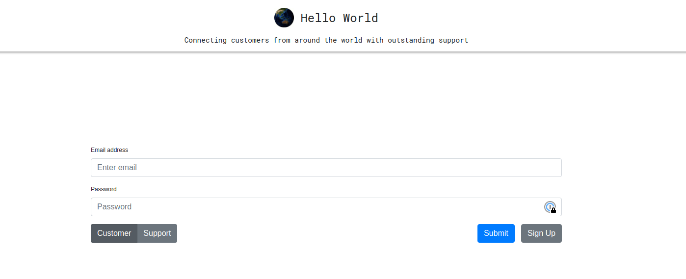
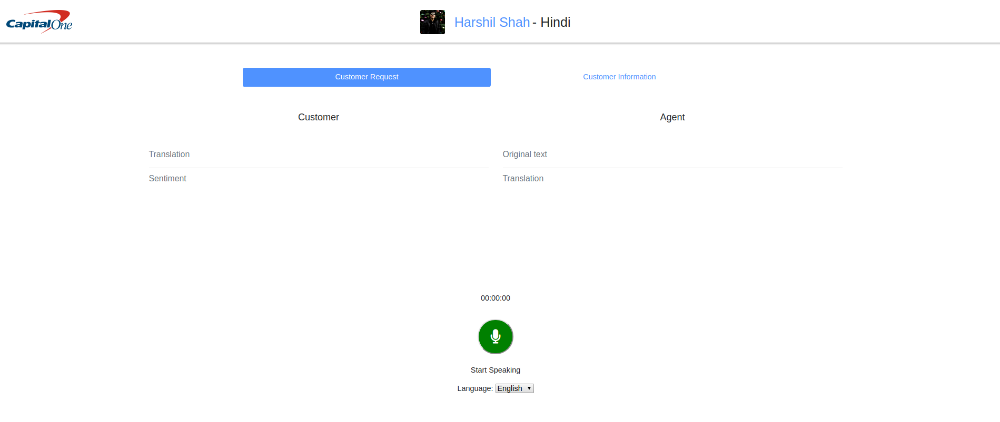
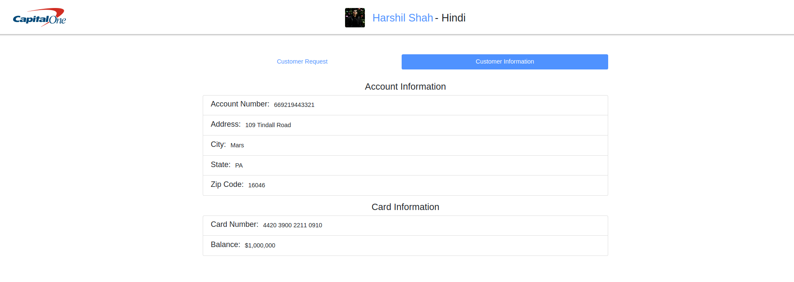

# capital-one-vocal-identification
Speaker Recognition/Identification

<p align="center">
  
  <br>
  
  <br>
  
  <br>
  
  <br>
  
</p>

# Running the Web App
All commands run witin the `clientsideapp` directory.

- Type `npm install` to install the dependencies.
- Type `npm install -g nodemon` to install nodemon.
- Start the server by typing `nodemon --exec npm start`.
- Navigate to `localhost:3000` in your web browser to view.

## REST API

### Examples

```javascript
// POST Request to /submitSpeech
{
    "keywords": [
        "would recommend capital one",
        "grocery store across",
        "credit card number",
        "someone stole",
        "quickly removed",
        "purchase items",
        "called c1",
        "10 years",
        "weekend",
        "way",
        "used",
        "problem",
        "paying",
        "never",
        "friends",
        "family",
        "country",
        "charges",
        "bills"
    ],
    "language": "en",
    "language_confidence": 1,
    "message": "Hello from the software engineering summit!",
    "new_text": "I have been paying my bills the same way for over 10 years, and I have never had a problem before this weekend.  Someone stole my credit card number and used it to purchase items at a grocery store across the country.  I called C1 and they quickly removed the charges.  I would recommend capital one to all of my friends and family.",
    "new_text_speech": "https://translate.google.com/translate_tts?ie=UTF-8&client=tw-ob&q=I%20HAVE%20BEEN%20PAYING%20MY%20BILLS%20THE%20SAME%20WAY%20FOR%20OVER%2010%20YEARS,%20AND%20I%20HAVE%20NEVER%20HAD%20A%20PROBLEM%20BEFORE%20THIS%20WEEKEND.%20%20SOMEONE%20STOLE%20MY%20CREDIT%20CARD%20NUMBER%20AND%20USED%20IT%20TO%20PURCHASE%20ITEMS%20AT%20A%20GROCERY%20STORE%20ACROSS%20THE%20COUNTRY.%20%20I%20CALLED%20C1%20AND%20THEY%20QUICKLY%20REMOVED%20THE%20CHARGES.%20%20I%20WOULD%20RECOMMEND%20CAPITAL%20ONE%20TO%20ALL%20OF%20MY%20FRIENDS%20AND%20FAMILY.&tl=en",
    "new_word_count": 66,
    "original_text": "I have been paying my bills the same way for over 10 years, and I have never had a problem before this weekend.  Someone stole my credit card number and used it to purchase items at a grocery store across the country.  I called C1 and they quickly removed the charges.  I would recommend capital one to all of my friends and family.",
    "sentiment": 0.17,
    "success": true,
    "time_elapsed": 0.07579779624938965,
    "verbosity": 0.47,
    "word_count": 66
}
```

```javascript
// GET Request to /genComment
{
    "keywords": [
        "would pay",
        "ruined credit",
        "payments due",
        "3 months",
        "job layoff",
        "job",
        "turned",
        "stress",
        "soon",
        "notified",
        "lien",
        "letters",
        "lawyer",
        "ignored",
        "house",
        "got",
        "filed",
        "brought",
        "behind",
        "3000"
    ],
    "message": "Hello from the software engineering summit!",
    "new_text_speech": "https://translate.google.com/translate_tts?ie=UTF-8&client=tw-ob&q=I%20WAS%20BEHIND%20ON%20PAYMENTS%20DUE%20TO%20JOB%20LAYOFF%20I%20NOTIFIED%20THEM%20THAT%20I%20WOULD%20PAY%20AS%20SOON%20AS%20I%20GOT%20MY%20JOB%20IN%203%20MONTHS%20THEY%20IGNORED%20MY%20LETTERS%20THEN%20TURNED%20ME%20OVER%20TO%20THEIR%20LAWYER%20WHO%20FILED%20A%20LIEN%20ON%20MY%20HOUSE%20FOR%203000%20IT%20HAS%20BROUGHT%20ME%20JUST%20STRESS%20AND%20RUINED%20CREDIT%20&tl=en",
    "sentiment": -0.26,
    "success": true,
    "text": "I was behind on payments due to job layoff. I notified them that I would pay as soon as I got my job in 3 months. They ignored my letters, then turned me over to their lawyer, who filed a lien on my house for $3000. It has brought me just stress and ruined credit. ",
    "verbosity": 0.45,
    "word_count": 56
}
```

### Current Features

- Keyword Extraction

- Language Detection

- Confidence of Language Detection

- Translation

- Custom Message (Ie: No Form data, etc.)

- Original Text (Said by the User)

- New Text (Translated Text)

- Sentiment Polarity (-1 -> 1)

- Request Processing Time
